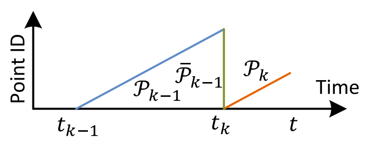
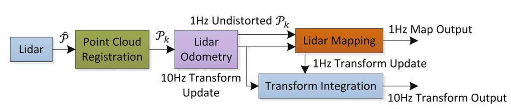
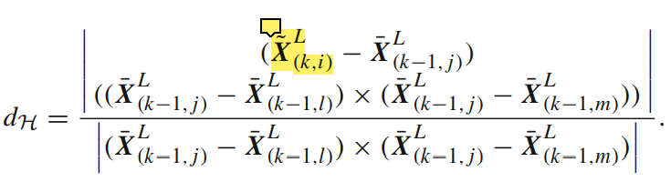
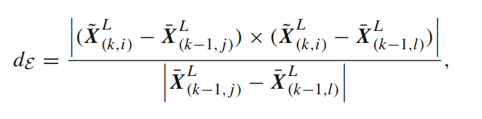

## LOAM笔记

### 符号描述

- $k$：帧号
- $\{L\}$：Lidar坐标系
- $\{W\}$：世界坐标系
- $\mathcal{Q}_{k-1}$：$k-1$时刻的世界地图
- $\mathcal{P}_{k}$：第$k$帧的数据，对应时间是$t_{k}$到$t_{k+1}$
- $\overline{\mathcal{P}}_{k-1}$：第$k-1$帧的数据$\mathcal{P}_{k-1}$投影到时刻$t_k$
- $\mathcal{E}_{k}$、$\mathcal{H}_{k}$：$\mathcal{P}_{k}$中的边缘点、平面点
- $\overline{\mathcal{E}}_{k}$、$\overline{\mathcal{H}}_{k}$：$\overline{\mathcal{P}}_{k}$中的边缘点、平面点
- $\tilde{\mathcal{E}}_{k}$、$\tilde{\mathcal{H}}_{k}$：$\mathcal{E}_{k}$、$\mathcal{H}_{k}$投影到时刻$t_k$
- $\boldsymbol{X}_{(k, i)}^{L}$：第$k$帧的第$i$点在`LiDAR`坐标系下的坐标
- $\boldsymbol{X}_{(k, i)}^{W}$：第$k$帧的第$i$点在世界坐标系下的坐标
- $\boldsymbol{T}_{k-1}^{W}(t_k)$：第$k-1$帧后，$t_k$时的雷达世界位姿
- $\boldsymbol{T}_{k}^{L}(t)$：$[t_k, t]$的位姿变换，Lida坐标系。$\boldsymbol{T}_{k}^{L}(t)=\left[\tau_{k}^{L}(t), \theta_{k}^{L}(t)\right]^{T}$，平移变换$\tau_{k}^{L}(t)=\left[t_{x}, t_{y}, t_{z}\right]^{T}$，旋转变换$\theta_{k}^{L}(t)=\left[\theta_{x}, \theta_{y}, \theta_{z}\right]^{T}$

### 框架

### 轨迹推演

#### 特征提取

- 平滑特征：平滑度低，平面点；平滑度高，边缘点

​	

- 避免点，不稳定点：
  - 已有周围点作为特征点
  - 平面点，该平面切于视线
  - 由于遮挡，而形成的边缘点

​	

- 为保证特征点均匀，对FOV进行划分。每份的特征点个数不得超过设定值

#### 特征匹配

- 根据$\mathcal{E}_{k}$、$\mathcal{H}_{k}$和$\tilde{\mathcal{E}}_{k}$、$\tilde{\mathcal{H}}_{k}$的距离选择匹配点

- 匹配度度量

  - 点面距离

    

  - 点线距离

    

#### 运动估计

- 假设是匀速的平移、旋转运动

$$
\boldsymbol{T}_{(k, i)}^{L}=\frac{t_{(k, i)}-t_{k}}{t-t_{k}} \boldsymbol{T}_{k}^{L}(t)\\
\tilde{\boldsymbol{X}}_{(k, i)}^{L}=\mathbf{R}_{(k, i)}^{L} \boldsymbol{X}_{(k, i)}^{L}+\tau_{(k, i)}^{L}
$$

优化点面距离、点线距离即可。

#### 轨迹推演

就是运动估计多次迭代优化

### 激光建图

- 确定雷达位置。输入是$\overline{\mathcal{P}}_{k}$、$\mathcal{Q}_{k-1}$

- 地图存储：10m的正方体，作为一个单元。匹配的时候，选择相交的单元作为匹配地图
- 地图下采样：边点，5cm正方体；面点，10cm正方体

